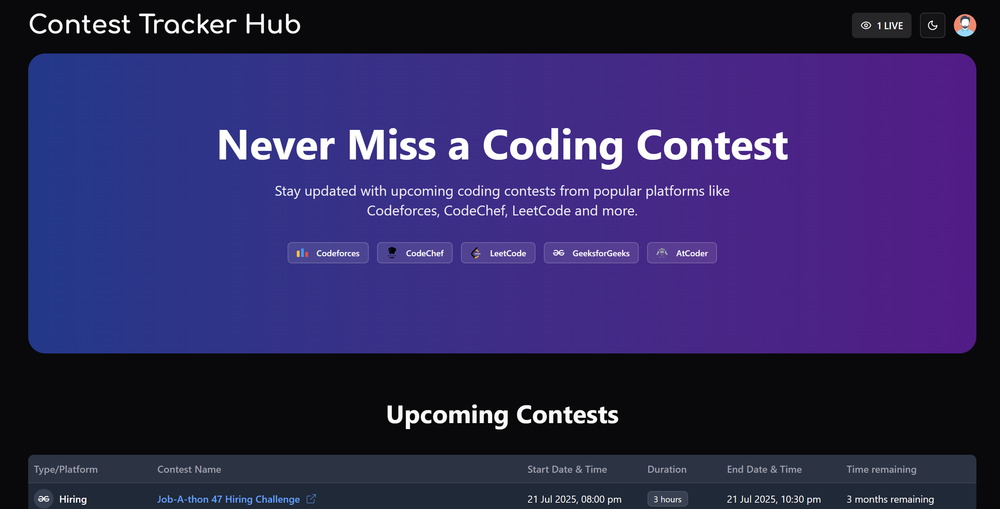
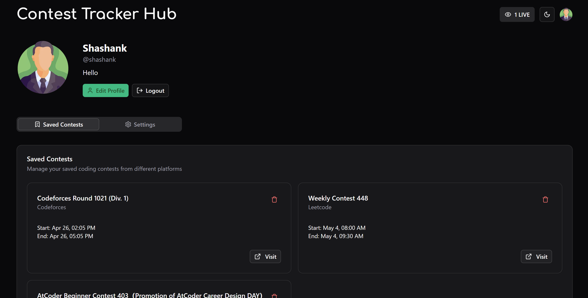
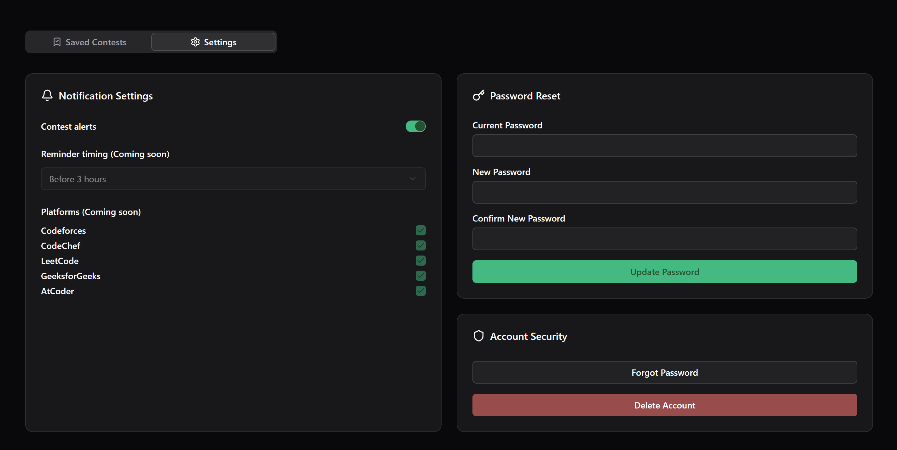

# Contest Tracker Hub

A centralized platform for tracking upcoming programming contests across major competitive coding platforms.

## About

Contest Tracker Hub is designed to help competitive programmers stay updated with upcoming contests from major platforms like Codeforces, LeetCode, CodeChef, AtCoder, and GeeksforGeeks. The platform aggregates contest information into a unified, easy-to-navigate system with advanced filtering, search capabilities, and real-time updates.

---

---

## Features

### Frontend Features
- **Centralized Contest Tracking**: View all upcoming contests from major platforms in one place
- **Real-time Updates**: Live user count and contest information updates
- **Filtering & Search**: Find contests by platform, date, or keywords
- **User Accounts**: Personalized profiles with contest preferences
- **Email Notifications**: Get reminders before contests start
- **Responsive Design**: Optimized for both desktop and mobile devices
- **Dark/Light Mode**: Theme support for better user experience
- **Bookmarking**: Save contests for later reference

### Backend Features
- **Automated Contest Aggregation**: Daily updates from top coding platforms
- **Real-time User Tracking**: Socket.IO integration for live user counts
- **JWT Authentication**: Secure user authentication system
- **Newsletter System**: Email subscriptions, reminders, and notifications
- **Worker & Job Management**: Scheduled tasks for contest updates and reminders
- **Rate Limiting**: Protection against abuse (100/15min for whitelisted, 10/15min otherwise)
- **Feedback Collection**: Structured feedback system with admin alerts
- **Comprehensive API**: RESTful endpoints for all platform features

## Pages

- **Home**: Dashboard showing upcoming contests with filtering options
- **About**: Information about the platform and its features
- **FAQ**: Frequently asked questions about the service
- **Privacy Policy**: Details about data handling and user privacy
- **Profile**: User account management and preferences
- **Login/Register**: Authentication pages

## Tech Stack

### Frontend
- **React 19**: Latest version of React for building the UI
- **Next.js 15**: React framework with App Router for server components and routing
- **TypeScript**: For type-safe code
- **Tailwind CSS**: Utility-first CSS framework for styling
- **Shadcn UI**: Component library built on Radix UI
- **Zustand**: State management
- **React Hook Form**: Form handling with Zod validation
- **Socket.io Client**: Real-time updates for contest information

### Backend
- **Next.js API Routes**: Server-side API endpoints
- **Node.js & Express.js**: Core server framework
- **TypeScript**: Type-safe backend code
- **MongoDB**: Database for storing contest and user information
- **Mongoose**: MongoDB object modeling
- **Redis**: Caching, queueing and real-time data management
- **Socket.io**: WebSocket implementation for real-time updates
- **BullMQ & Agenda.js**: Job scheduling and queue management
- **Nodemailer**: Email delivery system
- **JWT**: Authentication token management
- **bcryptjs**: Secure password hashing

## API Endpoints

### Contest Routes
- Fetch contests with filtering options

### User Routes
- Authentication (register, login, password reset)
- Profile management
- Contest bookmarking
- Preference settings

### Newsletter Routes
- Subscription management
- Email delivery logs

### Feedback & Monitoring
- Feedback submission
- Usage statistics
- System health monitoring

## Automated Tasks

- Daily contest updates at 1:00 AM IST
- Reminder emails before contests
- System health checks

## Security Features

- Dynamic rate limiting
- CORS protection
- Input validation
- Secure authentication
- Password hashing